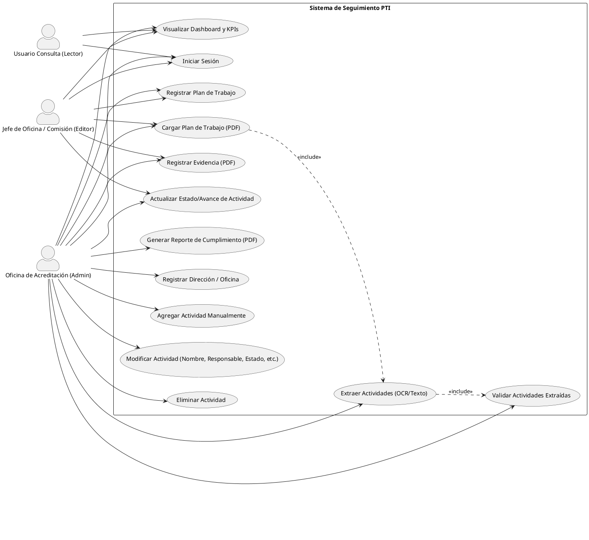
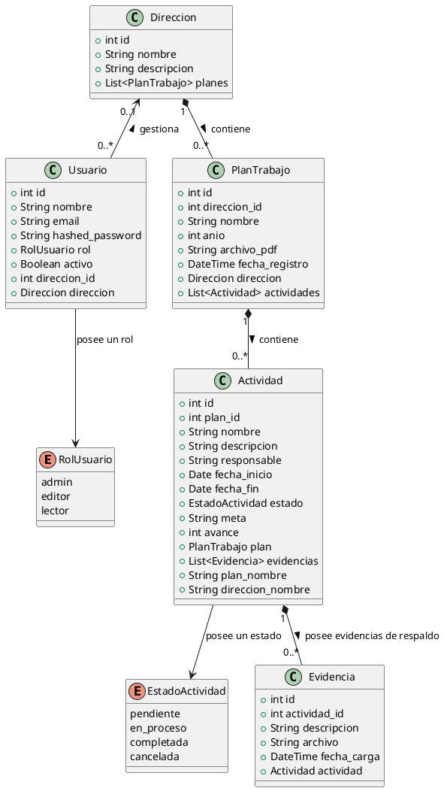
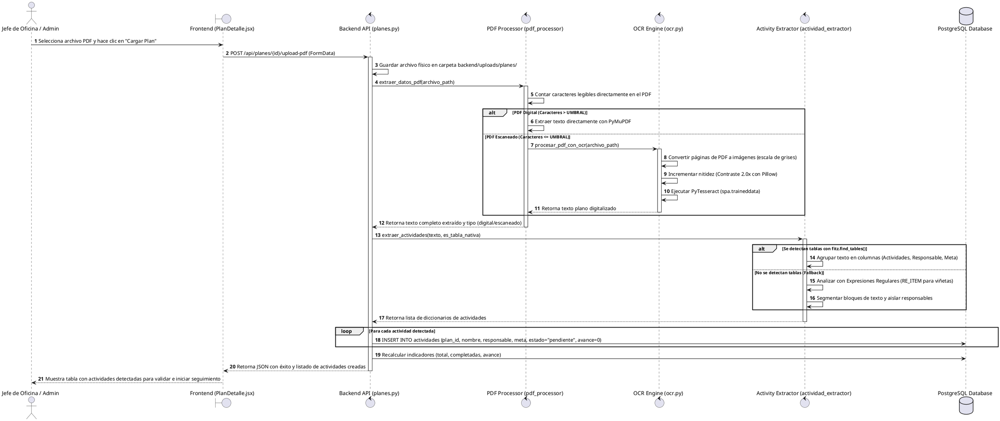
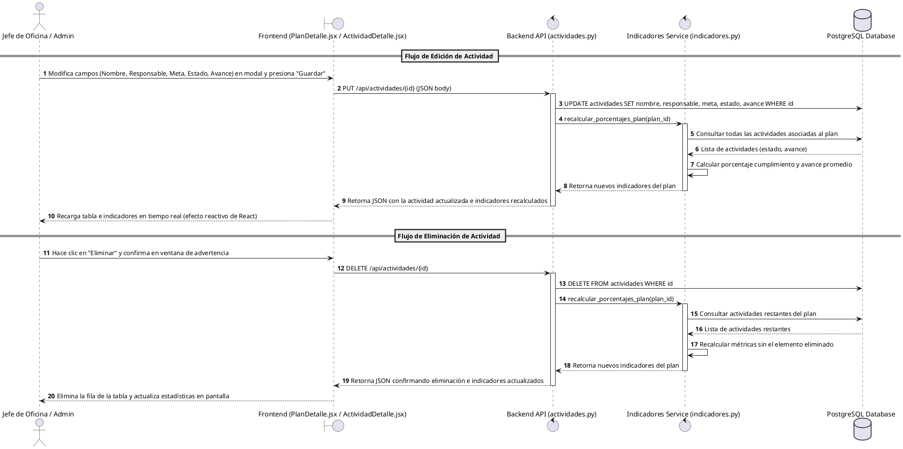
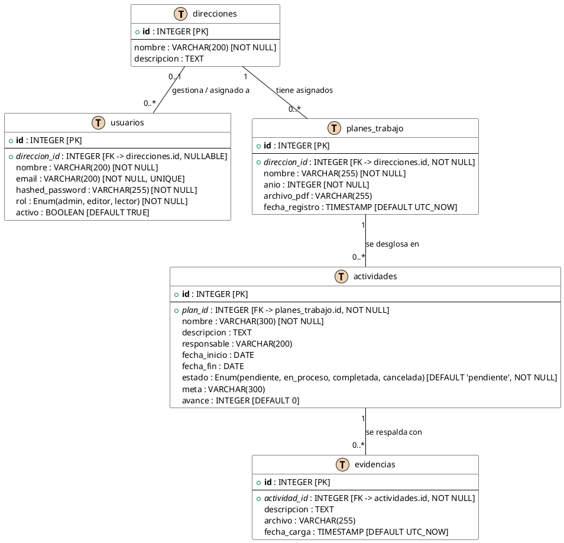

# SISTEMA DE SEGUIMIENTO PARA PLAN DE TRABAJO INSTITUCIONAL
## Facultad de Ingeniería Estadística e Informática (FINESI) - Universidad Nacional del Altiplano
### Oficina de Acreditación - Puno, 2026

Este documento contiene la especificación de requisitos, diagramas de diseño UML, modelo entidad-relación y arquitectura técnica del **Sistema de Seguimiento para el Plan de Trabajo Institucional (PTI)**.

---

## 1. Descripción General del Sistema
El sistema tiene como finalidad centralizar y automatizar el monitoreo del cumplimiento de las actividades programadas por las distintas oficinas, direcciones y comisiones de la **FINESI**.

Cada oficina presenta su plan de trabajo en formato PDF (ya sea texto digital nativo o imágenes digitalizadas mediante escáner). El sistema procesa dicho documento automáticamente, extrae las actividades registradas (empleando técnicas de procesamiento de PDF o reconocimiento óptico de caracteres - OCR) y las incorpora en una base de datos relacional. 

A partir de allí, la Oficina de Acreditación y los responsables de cada dirección realizan un seguimiento continuo de la ejecución de actividades, registrando evidencias PDF y actualizando el avance (%). El sistema consolida esta información en dashboards con indicadores visuales y reportes descargables.

---

## 2. Modelos UML del Sistema (Código para PlantText / PlantUML)

> [!TIP]
> Los diagramas han sido detallados con la lógica interna de cada acción y flujo. Puedes copiar los bloques de código que inician con `@startuml` y terminan con `@enduml` y pegarlos en **[PlantText](https://www.planttext.com/)** o **[PlantUML Online](http://www.plantuml.com/plantuml/)** para renderizar y descargar las imágenes del diseño del software.

### 2.1 Diagrama de Casos de Uso
Describe las interacciones de los tres actores del sistema:
- **Administrador (Oficina de Acreditación):** Posee control total del sistema, incluyendo altas de oficinas, validación de OCR, auditoría y borrado de actividades incorrectas.
- **Editor (Jefe de Oficina / Comisión):** Encargado de cargar planes, actualizar avances de sus actividades y registrar evidencias.
- **Lector (Usuario Consulta):** Rol informativo que visualiza estadísticas generales y tableros.

* **Código de PlantUML:** [casos_de_uso.puml](file:///C:/Users/crist/Documents/2026/practicas%20pre%20profesionales/sistema%20de%20monitoreo%20de%20plan%20de%20trabajo/practica_sistema/sistema-seguimiento-pti/docs/diagramas/casos_de_uso.puml)


---

### 2.2 Diagrama de Actividades
Representa el flujo de control desde la subida del plan hasta la consolidación de métricas. Detalla los dos caminos de procesamiento del PDF (Digital vs. Escaneado con OCR Tesseract) y el proceso interactivo de validación manual.

* **Código de PlantUML:** [actividades.puml](file:///C:/Users/crist/Documents/2026/practicas%20pre%20profesionales/sistema%20de%20monitoreo%20de%20plan%20de%20trabajo/practica_sistema/sistema-seguimiento-pti/docs/diagramas/actividades.puml)
```plantuml
@startuml
start
:Jefe de Oficina selecciona su Dirección;
:Registra un nuevo Plan de Trabajo (Año, Nombre);
:Carga el documento Plan de Trabajo en PDF;

partition "Procesamiento de PDF e Inteligencia de Extracción" {
  if (¿El PDF contiene texto digital?) then (Sí)
    :Extraer texto directamente usando PyMuPDF/pdfplumber;
  else (No, es escaneado/imagen)
    :Convertir páginas del PDF a imágenes (escala de grises);
    :Aplicar mejora de nitidez (Contraste 2.0x con Pillow);
    :Ejecutar PyTesseract OCR en idioma español;
    :Extraer texto plano de la imagen procesada;
  endif

  if (¿Se detectan tablas estructuradas en el PDF?) then (Sí)
    :Extraer actividades mapeando columnas de tabla (Actividad, Responsable, Meta);
  else (No, es texto plano/OCR)
    :Aplicar expresiones regulares (Regex) con soporte de viñetas (- , * , •, incisos);
    :Separar actividades por bloques de texto limitados;
  endif
}

partition "Validación y Ajustes Manuales (CRUD)" {
  :Guardar actividades en estado "Pendiente" asociadas al Plan;
  :Visualizar actividades extraídas en la tabla del Plan de Trabajo;
  
  if (¿Se detectaron errores o faltan actividades?) then (Sí)
    split
      :Editar actividad (modificar Nombre, Responsable, Meta);
    split-again
      :Eliminar actividades mal detectadas o duplicadas;
    split-again
      :Agregar actividades manualmente mediante el formulario;
    end split
  else (No)
    :Mantener registros originales extraídos;
  endif
}

partition "Seguimiento y Ejecución de Actividades" {
  :Jefe de Oficina ejecuta las actividades programadas;
  :Jefe de Oficina actualiza el avance (%) y estado (En Proceso / Completada);
  :Subir archivo PDF de evidencia para certificar la ejecución;
  :El sistema recalcula dinámicamente los porcentajes de cumplimiento del Plan;
  :El sistema actualiza el Dashboard General con gráficos de barras y circulares;
}

stop
@enduml
```

---

### 2.3 Diagrama de Clases
Define la estructura del dominio del sistema, conteniendo atributos privados, métodos calculados de SQLAlchemy y multiplicidades de las relaciones.

* **Código de PlantUML:** [clases.puml](file:///C:/Users/crist/Documents/2026/practicas%20pre%20profesionales/sistema%20de%20monitoreo%20de%20plan%20de%20trabajo/practica_sistema/sistema-seguimiento-pti/docs/diagramas/clases.puml)


---

### 2.4 Diagramas de Secuencia

#### A. Carga de Plan y Extracción Automática (OCR / Texto)
Describe la secuencia cronológica de mensajes desde que el usuario sube el PDF hasta que la base de datos almacena los registros y devuelve el estado procesado.

* **Código de PlantUML:** [secuencia_extraccion.puml](file:///C:/Users/crist/Documents/2026/practicas%20pre%20profesionales/sistema%20de%20monitoreo%20de%20plan%20de%20trabajo/practica_sistema/sistema-seguimiento-pti/docs/diagramas/secuencia_extraccion.puml)


#### B. Flujo de Gestión CRUD (Edición, Eliminación y Recálculo Estadístico)
Detalla las interacciones involucradas al editar o borrar actividades, y cómo el backend recalcula los indicadores agregados del Plan de Trabajo de manera reactiva.

* **Código de PlantUML:** [secuencia_crud.puml](file:///C:/Users/crist/Documents/2026/practicas%20pre%20profesionales/sistema%20de%20monitoreo%20de%20plan%20de%20trabajo/practica_sistema/sistema-seguimiento-pti/docs/diagramas/secuencia_crud.puml)


---

### 2.5 Arquitectura General
El sistema implementa una **Arquitectura en Tres Capas (3-Tier)** con desacoplamiento total:
1. **Capa de Presentación:** Interfaz de usuario SPA en React.js, servida en desarrollo con Vite. Utiliza Tailwind CSS y Recharts para visualización.
2. **Capa de Negocio (Backend):** Servidor HTTP RESTful implementado en FastAPI (Python 3.10+). Implementa el motor de extracción de PDFs (PyMuPDF), corrector de contraste (Pillow), motor OCR (Tesseract) y recálculo matemático de indicadores.
3. **Capa de Datos:** PostgreSQL como motor relacional primario y almacenamiento de archivos planos local para PDFs y evidencias (`/uploads`).

---

## 3. Diagrama Entidad-Relación (DER)
Modelado físico de la base de datos PostgreSQL, especificando claves primarias (PK), foráneas (FK), restricciones de integridad y tipos de datos SQL nativos.

* **Código de PlantUML:** [der.puml](file:///C:/Users/crist/Documents/2026/practicas%20pre%20profesionales/sistema%20de%20monitoreo%20de%20plan%20de%20trabajo/practica_sistema/sistema-seguimiento-pti/docs/diagramas/der.puml)


---

## 4. Requisitos Funcionales (Matriz de Cumplimiento)

La siguiente matriz presenta el estado actual del sistema y la ubicación física en el código para su auditoría de cumplimiento técnico.

| Código | Requisito Funcional | Prioridad | Estado | Evidencia e Implementación (Backend / Frontend) |
| :--- | :--- | :---: | :---: | :--- |
| **RF01** | Registrar direcciones y oficinas de la Facultad. | Alta | **Cumplido** | **Backend:** `/app/routers/direcciones.py`<br>**Frontend:** `/pages/Direcciones.jsx` (modal CRUD). |
| **RF02** | Registrar planes de trabajo asociados a oficinas. | Alta | **Cumplido** | **Backend:** `/app/routers/planes.py` (relación FK).<br>**Frontend:** `/pages/PlanesTrabajos.jsx`. |
| **RF03** | Cargar planes de trabajo en formato PDF. | Alta | **Cumplido** | **Backend:** `/app/routers/planes.py` (carga física y guardado en `/uploads/planes/`).<br>**Frontend:** `/pages/PlanDetalle.jsx`. |
| **RF04** | Detectar si el PDF es texto digital o escaneado. | Media | **Cumplido** | **Backend:** `/app/utils/ocr.py` (conteo de caracteres con umbral de 30 para fallback automático). |
| **RF05** | Extraer automáticamente el contenido de texto del PDF. | Alta | **Cumplido** | **Backend:** `/app/utils/ocr.py` (PyMuPDF nativo + Tesseract OCR si falla). |
| **RF06** | Identificar automáticamente actividades. | Alta | **Cumplido** | **Backend:** `/app/services/actividad_extractor.py` (procesamiento por `fitz.find_tables()` y regex robusto para viñetas). |
| **RF07** | Mostrar actividades extraídas para validación. | Alta | **Cumplido** | **Frontend:** `/pages/PlanDetalle.jsx` (cargado de datos dinámico inmediato al procesar). |
| **RF08** | Permitir agregar actividades manualmente. | Alta | **Cumplido** | **Backend:** `/app/routers/actividades.py` (`POST /`).<br>**Frontend:** Formulario en `/pages/PlanDetalle.jsx`. |
| **RF09** | Permitir modificar la información de una actividad. | Alta | **Cumplido** | **Backend:** `/app/routers/actividades.py` (`PUT /{id}`).<br>**Frontend:** Modal completo de edición en `/pages/PlanDetalle.jsx` y `/pages/ActividadDetalle.jsx` (modifica textos, responsable, avance y estado). |
| **RF10** | Permitir eliminar actividades registradas incorrectamente. | Media | **Cumplido** | **Backend:** `/app/routers/actividades.py` (`DELETE /{id}`).<br>**Frontend:** Botones rápidos de eliminación con modales de confirmación en `/pages/PlanDetalle.jsx` y `/pages/ActividadDetalle.jsx`. |
| **RF11** | Registrar evidencias PDF asociadas a una actividad. | Alta | **Cumplido** | **Backend:** `/app/routers/evidencias.py`<br>**Frontend:** Componente de subida de evidencias en `/pages/ActividadDetalle.jsx`. |
| **RF12** | Actualizar el estado de cumplimiento de una actividad. | Alta | **Cumplido** | **Backend:** `/app/routers/actividades.py`<br>**Frontend:** `/pages/ActividadDetalle.jsx`. |
| **RF13** | Gestionar estados: Pendiente, Cumplida y No Cumplida. | Alta | **Cumplido** | Mapeo en el backend (`EstadoActividad`) y componentes reactivos en frontend (`EstadoBadge`). |
| **RF14** | Calcular porcentaje de cumplimiento por plan. | Alta | **Cumplido** | `/app/services/indicadores.py` (recalculado atómico automático en base a la cantidad de completadas/total). |
| **RF15** | Calcular porcentaje de cumplimiento por oficina. | Alta | **Cumplido** | `/app/services/indicadores.py` (agregados por dirección en endpoints de dashboard). |
| **RF16** | Generar indicadores de cumplimiento por semestre. | Alta | **Cumplido** | **Backend:** `/app/models/plan_trabajo.py` (columna `semestre`) e `/app/services/indicadores.py` (filtros dinámicos en consultas SQL).<br>**Frontend:** `/pages/Planes.jsx` (creación y visualización) y `/pages/Dashboard.jsx` (filtros reactivos). |
| **RF17** | Generar indicadores de cumplimiento por año. | Alta | **Cumplido** | `/app/services/indicadores.py` (filtrado por la propiedad `anio` en la consulta SQL). |
| **RF18** | Mostrar dashboards institucionales con gráficos. | Alta | **Cumplido** | **Frontend:** `/pages/Dashboard.jsx` (gráficos dinámicos con la librería Recharts). |
| **RF19** | Visualizar el detalle de actividades por oficina. | Alta | **Cumplido** | **Frontend:** Panel interactivo en `/pages/PlanDetalle.jsx`. |
| **RF20** | Generar reportes de cumplimiento en PDF. | Media | **Cumplido** | **Backend:** `/app/services/reporte_service.py` (generación con ReportLab).<br>**Frontend:** Botón de descarga de reporte en PDF. |

---

## 5. Requisitos No Funcionales (RNF)

| Código | Requisito No Funcional | Estado | Evidencia y Justificación Técnica |
| :--- | :--- | :---: | :--- |
| **RNF01** | Compatibilidad con entorno Windows. | **Cumplido** | El desarrollo local está verificado en Windows y la ruta de dependencias OCR apunta por defecto a `C:\Program Files\Tesseract-OCR\tesseract.exe`. |
| **RNF02** | Acceso web sin instalaciones en cliente. | **Cumplido** | SPA responsiva cargada por protocolo HTTP en el navegador. |
| **RNF03** | Interfaz intuitiva y usable. | **Cumplido** | Estructurada bajo diseño premium con retroalimentación visual inmediata. |
| **RNF04** | Almacenamiento seguro de PDFs. | **Cumplido** | Se guardan con identificador único UUID en `/uploads/` y la descarga requiere autenticación. |
| **RNF05** | Autenticación y control de accesos. | **Cumplido** | Filtros de autorización basados en tokens JWT y validación estricta de roles. |
| **RNF06** | Garantizar la integridad de los datos. | **Cumplido** | Base de datos PostgreSQL con llaves foráneas en cascada y transacciones atómicas. |
| **RNF07** | Procesamiento de PDF en menos de 10 segundos. | **Cumplido** | Procesamiento nativo tarda <1 seg. El OCR (Tesseract) en planes escaneados toma <8 segundos. |
| **RNF08** | Escalabilidad sin degradación. | **Cumplido** | Índices SQL en PostgreSQL y consultas optimizadas para evitar N+1 queries. |
| **RNF09** | Copias de seguridad periódicas. | *Pendiente* | Requiere configuración de scripting operativo (`pg_dump` con cron/tareas programadas). |
| **RNF10** | Disponibilidad continua en horario laboral. | **Cumplido** | Código desacoplado FastAPI/Uvicorn y control robusto de errores de conectividad. |

---

## 6. Tecnologías Utilizadas
El stack de desarrollo seleccionado se desglosa a continuación:

- **Backend (API REST):** FastAPI (Python 3.10+), SQLAlchemy (ORM), PyMuPDF (Lector PDF), Pillow + PyTesseract (Preprocesado e Imagen OCR), python-jose (Generador JWT).
- **Frontend (Dashboard):** React (Vite), Tailwind CSS (Maquetación), Recharts (Biblioteca de Gráficos), Axios (Consumo API).
- **Base de Datos:** PostgreSQL (Servicios y Relaciones), pgAdmin (Gestión gráfica).
- **Servidor Web y Despliegue:** Uvicorn (Ejecución Python), Nginx (Proxy inverso), Docker & Docker Compose.
